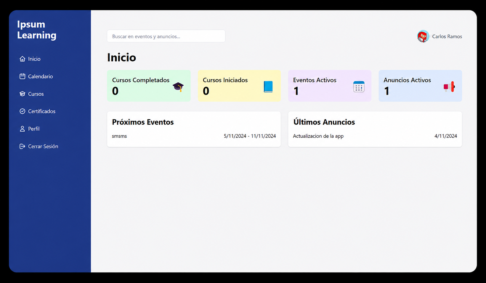

# IpsumTech Learning Platform

<p>
  
  
  
  
</p>

Online learning platform developed for **Ipsum Technology**. Users can explore courses, track their learning progress and obtain completion certificates through a responsive web interface.

This repository is published with permission as part of my professional portfolio.

<p align="center">
  
</p>

## Overview

IpsumTech Learning Platform provides users with a centralized space for accessing online training content.

The application includes user authentication, course visualization, progress management and certificate workflows. Firebase provides authentication and data services, while React and Tailwind CSS power the user interface.

## Main features

### User experience

- User registration and authentication
- Course catalog and content visualization
- Learning progress tracking
- Certificates after course completion
- Responsive interface for desktop and mobile devices
- Clear navigation between learning sections

### Platform functionality

- Firebase Authentication integration
- Course and user data managed with Firebase
- Real-time information updates
- Cloud functionality through Firebase
- Protected user-specific information
- Firebase Hosting configuration

## Technology stack

| Area | Technology |
|---|---|
| User interface | React |
| Styling | Tailwind CSS |
| Authentication | Firebase Authentication |
| Data | Firebase |
| Cloud backend | Firebase Cloud Functions |
| Hosting | Firebase Hosting |
| Language | JavaScript |

## My contribution

I participated in the development of this application during my experience with Ipsum Technology.

My work included:

- Building and improving React user interfaces
- Creating responsive layouts with Tailwind CSS
- Integrating Firebase Authentication
- Connecting application screens with Firebase data
- Implementing course progress workflows
- Supporting certificate functionality
- Configuring and testing the web application
- Documenting the project setup

## Project structure

```text
ipsumtech-learning-platform/
├── functions/              # Firebase Cloud Functions
├── public/                 # Public static assets
├── src/
│   ├── components/         # Reusable interface components
│   ├── pages/              # Main application pages
│   ├── services/           # Firebase and data services
│   ├── App.js              # Root component
│   └── index.js            # Application entry point
├── assets/                 # README screenshots
├── .env.example            # Environment variable template
├── .firebaserc             # Firebase project configuration
├── firebase.json           # Firebase services configuration
├── package.json            # Dependencies and scripts
└── README.md
```

## Getting started

### Requirements

- Node.js
- npm
- Git
- A Firebase project

### Installation

Clone the repository:

```bash
git clone https://github.com/frannnkkyy/ipsumtech-learning-platform.git
```

Open the project:

```bash
cd ipsumtech-learning-platform
```

Install the dependencies:

```bash
npm install
```

Create your local environment file:

```bash
cp .env.example .env
```

Add your Firebase configuration to `.env`, then start the application:

```bash
npm start
```

Open [http://localhost:3000](http://localhost:3000) in your browser.

## Environment variables

Create `.env.example` with the variable names required by the application. Keep every value empty:

```env
REACT_APP_FIREBASE_API_KEY=
REACT_APP_FIREBASE_AUTH_DOMAIN=
REACT_APP_FIREBASE_PROJECT_ID=
REACT_APP_FIREBASE_STORAGE_BUCKET=
REACT_APP_FIREBASE_MESSAGING_SENDER_ID=
REACT_APP_FIREBASE_APP_ID=
```

Never add real credentials or administrative secrets to `.env.example`.

## Firebase Functions

Install the function dependencies:

```bash
cd functions
npm install
```

The `functions` directory contains the cloud-side functionality used by the platform.

## Security considerations

- Environment files are excluded from Git
- User access is handled through Firebase Authentication
- Database access should be protected with Firebase Security Rules
- Firebase debug logs are excluded from the repository
- Administrative credentials must never be included in frontend code

## What I learned

This project helped me strengthen my experience with:

- Building reusable React interfaces
- Creating responsive designs with Tailwind CSS
- Integrating Firebase Authentication
- Managing application data with Firebase
- Organizing a production-oriented frontend project
- Deploying and configuring a Firebase application
- Documenting a project for other developers

## Project context

This application was developed for Ipsum Technology and is published with permission for portfolio presentation.

The repository demonstrates my contribution to the interface, Firebase integration and course-management experience. Company or user-sensitive information is not included.

## Author

**Carlos Constantino**

- Portfolio: [portafoliofrann.netlify.app](https://portafoliofrann.netlify.app/)
- LinkedIn: [linkedin.com/in/fcoocarlos](https://www.linkedin.com/in/fcoocarlos/)
- GitHub: [github.com/frannnkkyy](https://github.com/frannnkkyy)
